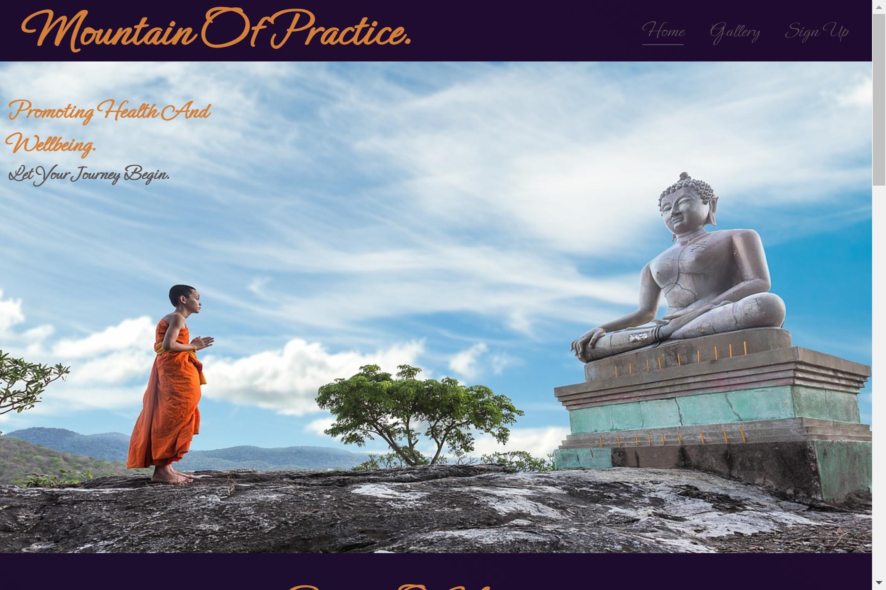

# Mountain of practice.

- The Mountain of practice website is a landing page for people trying to learn about the importance of  mindfullness. Mountain of practice offers benefits of mindfullness techniques.

- Users of this website will be able to learn about the benefits of mediation/mindfullness, a gallery of peaceful images and a sign up form. This site is targeted towards those who want to better their mind and learn the benifits of mediation.

 

## Features 

- __Navigation Bar__

- Featured at the top of the page, the navigation shows the wedsite name in the left corner: 'Mountain of practice.' that links to the top of the page.

- The other navigation links are to the top right:Home, Gallery, Sign Up which all link to different sections of the website. 

- The navigation is in a font that looks good for a mindfullness page, and a color that contrasts with the background and is in a similar color to the mans robes in the main image.

- The navigation clearly tells the user the name of the website and makes the different sections of the website easy to find.

- __The header__

  - The header shows the name of the website, using the color of orange with a purple background. Keeping with the theme of mindfullness and monks.
  
  - The header explains the website is promoting health and wellbeing. A website showing the benefits of mediation and mindfullness.

  - This section provides clear information about what the site is and where the pages are located.

- __Benefits Of Meditation__

  - The benefits of meditation section gives details about what the benefits of meditation are.
  
  - This section shows the user the important information about meditation:How it can help in different ways including medical conditions,kids in schools and improving our mental state.

- __5 day challenge__

  - This section will allow the user to see the tasks for the 5 day challenge. 
  - It clearly shows the different days and challenges for each day. 

- __The Footer__ 

  - The footer section includes links to the relevant social media sites for Mountain of practice. The links will open to a new tab to allow easy navigation for the user. 
  - The footer is valuable to the user as it encourages them to keep connected via social media.

- __Gallery__

  - The gallery will provide the user with supporting images to help them get into a state of calm and peace, each photo in the gallery is keeping with the theme of mindfullness and a state of peace.
  - This section is valuable to the user as they will be able to focus on getting into a good mindset and a state of relaxation.

- __The Sign Up Page__

  - This page will allow the user to get signed up to Mountain of practice to start their mindfullness journey. The user will be asked to submit their full name and email address. 

## Testing 
 - I tested that this page works for differen't browsers:Firefox,Chrome,Safari.
 
 - I confirmed that this project looks good, keeps a theme throughout the 3 pages, functions a devtools device toolbar and is responsive.

 -I have confirmed that the signup form works:it needs entries in every field and the submit button works as intended.

 ## Validator testing
 - HTML 
 - No errors were returned when passing through the official W3C validator.

 - CSS
 - No errors were returned when passing through the Jigsaw validator.

 - Accessibility 
 - I confirmed that the fonts and colors chosen are easily read and accessible by running it through lighthouse in devtools.

 

### Bugs

- Once the website was deployed, there was thankfully no bugs to be shown.

## Deployment

- The site was deployed to GitHub pages. The steps to deploy are as follows: 
  - In the GitHub repository, navigate to the Settings tab 
  - From the source section drop-down menu, select the Master Branch
  - Once the master branch has been selected, the page will be automatically refreshed with a detailed ribbon display to indicate the successful deployment. 

The live link can be found here - https://andrewmcnamara117.github.io/Portfolio-1-html-css/

### Content

- The code to take the social media links was taken from CI LOVE RUNNING Project.
- The code used to create the sign up page was used from https://www.w3schools.com/howto/howto_css_login_form.asp
- The icons in the footer were taken from [Font Awesome](https://fontawesome.com/)

### Media

- The photos used on the home, gallery and sign up page are from This Open Source site https://pixabay.com/ 

